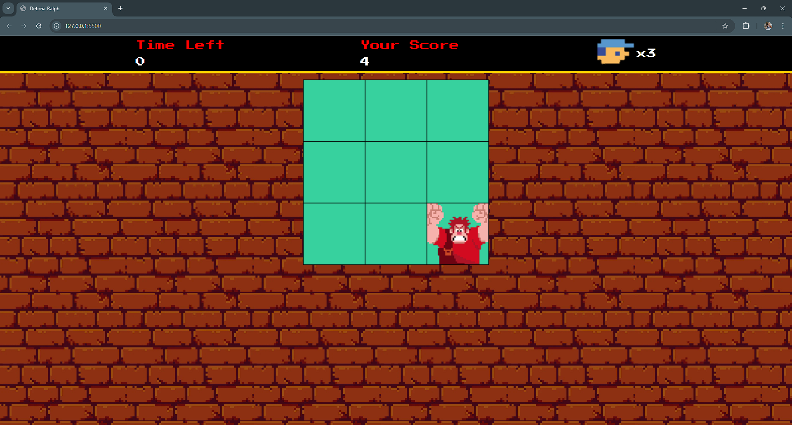

# Detona Ralph - Jogo em HTML, CSS e JavaScript

Este projeto é uma implementação de um jogo inspirado no filme **Detona Ralph**, desenvolvido como parte de um desafio de código proposto pela [Digital Innovation One (DIO)](https://www.dio.me/). O projeto foi construído utilizando **HTML, CSS e JavaScript**.


## 🕹️ Sobre o Projeto

O objetivo do jogo é acumular a maior pontuação possível dentro de 60 segundos. Ralph aparece aleatoriamente em uma matriz de janelas de 9x9, e o jogador precisa clicar no momento certo para marcar pontos. Cada acerto aumenta a pontuação, enquanto o tempo passa, adicionando um elemento de desafio e precisão ao jogo.

## 📋 Tecnologias Utilizadas

- **HTML5**: Estrutura do jogo e elementos de interface.
- **CSS3**: Estilização e animações dos elementos do jogo.
- **JavaScript**: Lógica de jogo e manipulação de eventos.

## 🚀 Como Jogar

1. Clone o repositório para sua máquina:
```
git clone https://github.com/seu-usuario/detona-ralph-jogo.git
```
2. Abra o arquivo `index.html` em um navegador de sua preferência.

3. Ralph aparecerá em uma posição aleatória na matriz de 9x9. Clique na janela onde ele aparece para marcar pontos.

4. O jogo dura 60 segundos. Tente fazer o máximo de pontos dentro desse tempo!

## 📂 Estrutura do Projeto

- **index.html**: Arquivo principal contendo a estrutura do jogo.
- **style.css**: Arquivo de estilo responsável pela aparência dos elementos.
- **script.js**: Arquivo JavaScript que controla a lógica do jogo e interações do usuário.

## 🛠️ Funcionalidades

- Aparecimento aleatório do Ralph na matriz de janelas 9x9.
- Contador de tempo regressivo para 60 segundos.
- Pontuação ao clicar na posição correta do Ralph.
- Efeitos sonoros e música de fundo.

## 📝 Melhorias Futuras

- Incluir diferentes níveis de dificuldade.
- Adicionar personagens e habilidades especiais.

## Demonstração

Insira um gif ou um link de alguma demonstração


## 🖼️ Screenshots


## Autor

- [@hyants](https://www.github.com/hyants)


